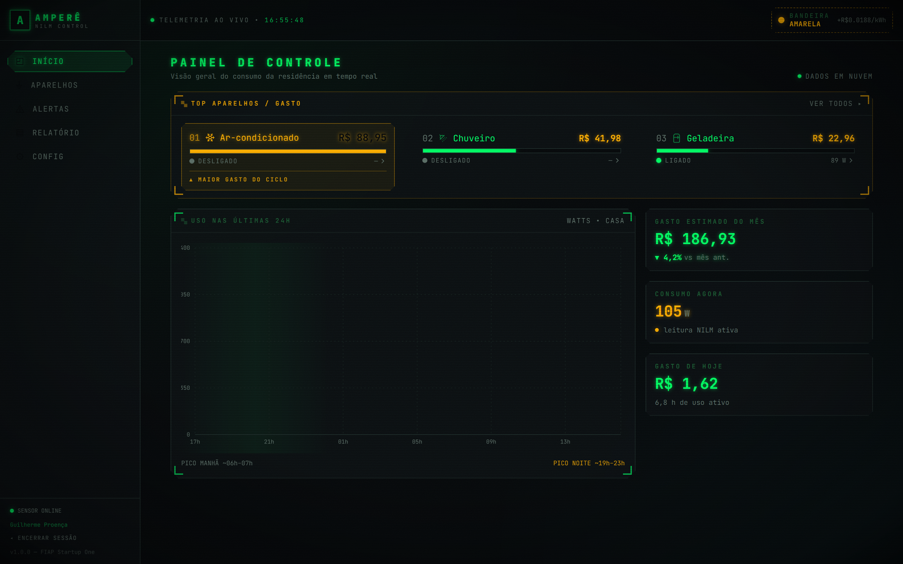
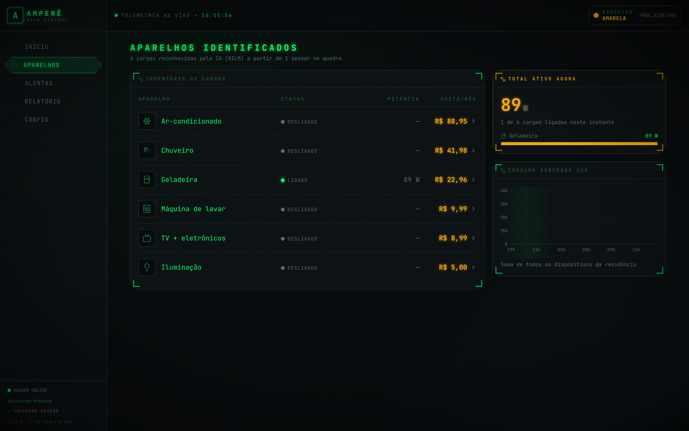
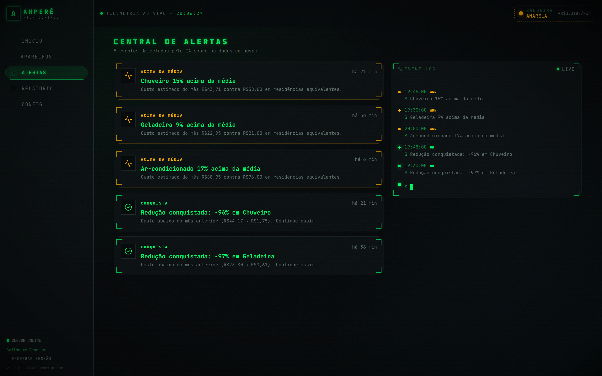
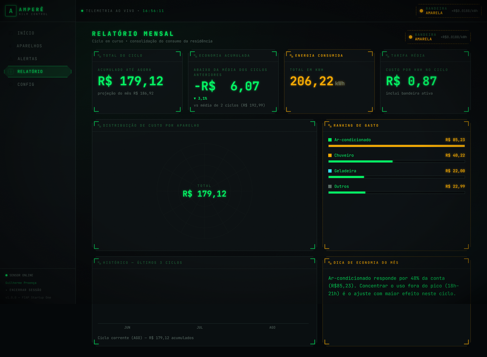
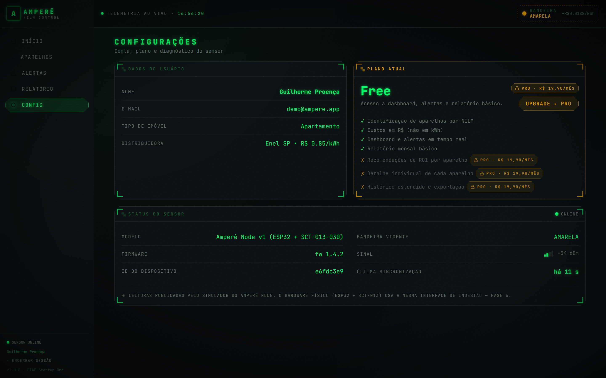
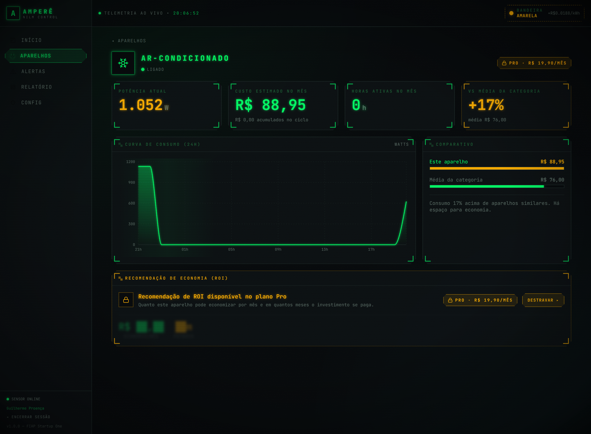

# ⚡ Amperê — MVP NILM (Fase 5)

Sistema de monitoramento energético residencial baseado em **NILM**
(*Non-Intrusive Load Monitoring*): **um único sensor** no quadro elétrico
(ESP32 + SCT-013-030) mede a corrente total da casa, e o software separa dali o
consumo de cada aparelho — mostrando tudo em **R$**, não em kWh.

> **CP5 — "MVP Completo: Programando a Solução e Produzindo um Produto"**
> Startup One (FIAP) · Fase 5.
> Front-end e back-end reais, banco em nuvem, autenticação e ingestão de
> telemetria. O CP4 era protótipo com dados locais; agora tudo vem do banco.

---

## 🖥️ Telas

### Dashboard


### Aparelhos (NILM)


### Alertas


### Relatório mensal


### Configurações


### Detalhe do aparelho (ROI bloqueado no plano Free)


> Todas as telas acima são capturas do sistema rodando contra o banco em nuvem,
> geradas por `npm run shots`.

---

## 🌐 Ambiente em nuvem

| | |
| --- | --- |
| **Provedor** | Supabase (PostgreSQL gerenciado) |
| **Projeto** | `ampere` · região `us-west-2` |
| **URL** | `https://mykkhodwculqhvcpsyng.supabase.co` |
| **Migrations aplicadas** | 8 |
| **Volume** | 8.640 leituras agregadas · 4.514 eventos de aparelho · 2.162 horas em `dim_tempo` |

**Conta de demonstração:** `demo@ampere.app` / `ampere2026`

---

## 🏗️ Arquitetura

```
┌─────────────────────┐
│  Amperê Node        │   ESP32 + SCT-013-030 no quadro elétrico.
│  (hardware — F6)    │   Hoje substituído por server/src/simulator/,
│                     │   que publica no MESMO endpoint e formato.
└──────────┬──────────┘
           │  POST /ingest/readings          autenticação: X-Device-Key
           │  { leituras: [{ registrado_em, potencia_w }] }
           ▼
┌─────────────────────────────────────────────────────────┐
│  API  ·  Node + Express + TypeScript      (Render)      │
│                                                          │
│   middleware   Bearer token (Supabase Auth) · Zod · CORS │
│   nilm/        detector de degraus — troca sem tocar     │
│                no resto do sistema                       │
│   services/    tarifa · tempo · ROI · agregações         │
│   routes/      auth · ingest · dashboard · devices ·     │
│                alerts · reports · settings               │
└──────────┬───────────────────────────────────────────────┘
           │  supabase-js (service role)
           ▼
┌─────────────────────────────────────────────────────────┐
│  PostgreSQL  ·  Supabase                    (nuvem)      │
│                                                          │
│   Star Schema: 6 dimensões + 2 fatos                     │
│   RLS por usuário · funções de agregação em SQL          │
│   Supabase Auth para identidade                          │
└──────────▲───────────────────────────────────────────────┘
           │  REST/JSON  ·  Bearer token
           │
┌──────────┴──────────────────────────────────────────────┐
│  Web  ·  React + Vite + TypeScript          (Vercel)     │
│                                                          │
│   src/api/       cliente tipado — única fonte de dados   │
│   src/auth/      sessão persistida e revalidada          │
│   src/pages/     6 telas, atualização periódica          │
└──────────────────────────────────────────────────────────┘
```

**Por que o front não fala direto com o Supabase.** Seria possível — o Supabase
expõe PostgREST. Mas o back-end é onde vive o NILM, o cálculo de tarifa, a
projeção do mês e as regras de plano. Colocar isso no navegador significaria
mandar a lógica de negócio junto com o bundle e confiar no cliente para
calcular preço. A API existe para que a regra fique de um lado só.

---

## 🧱 Stack por camada

| Camada | Escolha | Por quê |
| --- | --- | --- |
| **Banco** | PostgreSQL (Supabase) | Star Schema modelado no CP3 é relacional. Precisávamos de `percentile_cont`, window functions e RLS — coisas que um NoSQL não entrega de graça. |
| **Nuvem** | Supabase | Postgres gerenciado + Auth + RLS na mesma camada, com plano gratuito compatível com o escopo do projeto. Sem servidor de autenticação próprio para manter. |
| **Auth** | Supabase Auth (JWT) | Evita reimplementar hash de senha, refresh e expiração. O `id` de `auth.users` **é** a PK de `dim_usuario`, então RLS resolve com `auth.uid()`. |
| **Back-end** | Node + Express + TypeScript | Mesma linguagem e mesmos tipos do front. Express porque o escopo (10 rotas) não justifica framework maior. |
| **Validação** | Zod | Schema de entrada e tipo TypeScript no mesmo lugar — payload inválido morre na borda, não no meio de uma query. |
| **Front** | React + Vite + TypeScript | Já era a stack do CP4. Vite pelo build rápido e pelo `import.meta.env`, usado no fallback offline. |
| **Estilo** | Tailwind (tema HUD) | Identidade visual do CP4 preservada integralmente: grafite, verde-terminal `#00FF66`, âmbar nos alertas, JetBrains Mono, gráficos com glow. |
| **Gráficos** | Recharts | Composable o bastante para os gráficos "osciloscópio" com filtro de glow em SVG. |
| **Deploy** | Vercel (front) + Render (API) | Deploy por push, HTTPS automático, plano gratuito. |

---

## 🗄️ Banco de dados

Modelagem dimensional (Star Schema) definida no CP3, aplicada como **migrations
versionadas** em [`supabase/migrations/`](supabase/migrations/).

### Dimensões

| Tabela | Conteúdo |
| --- | --- |
| `dim_usuario` | `id` (= `auth.users.id`), nome, email, tipo_imovel, plano, criado_em |
| `dim_dispositivo` | sensor por usuário: apelido, status_conexao, versao_firmware, sinal_wifi, ultimo_contato, chave_ingestao |
| `dim_aparelho` | carga identificada pelo NILM: nome, categoria, potencia_nominal_w, identificado_em |
| `dim_tempo` | grão horário: data, ano, mês, dia, hora, dia_semana, eh_fim_de_semana |
| `dim_tarifa` | concessionária, uf, tarifa_kwh, bandeira, adicional_bandeira, vigência |
| `dim_plano` | nome, preco_mensal, recursos (`jsonb`) |

### Fatos

| Tabela | Grão | Conteúdo |
| --- | --- | --- |
| `fato_leitura_agregada` | 15 min | potência instantânea, energia, custo — o que o sensor mede |
| `fato_evento_aparelho` | evento | liga/desliga por aparelho, duração, energia, custo, confiança da detecção |

Índices em todas as FKs e em `registrado_em`. **RLS habilitada em todas as
tabelas**: cada usuário só alcança as próprias linhas (`auth.uid()`), e
`dim_tempo` / `dim_tarifa` / `dim_plano` ficam como referência de leitura.

O back-end usa a *service role*, que por definição contorna RLS — o escopo por
usuário é aplicado na query. As políticas protegem o acesso direto ao PostgREST
com a chave anônima.

### Agregação no banco

30 dias de leituras são 2.880 linhas; 90 dias, 8.640. Trazer isso para o Node a
cada request não escala, então a agregação roda em SQL:

`resumo_periodo` · `serie_por_hora` · `serie_aparelho_por_hora` ·
`custo_por_aparelho` · `custo_mensal` · `estado_aparelhos` · `saude_aparelhos`

---

## 🔌 API

Base local: `http://localhost:3333`

| Método | Rota | Auth | Função |
| --- | --- | --- | --- |
| `POST` | `/auth/signup` | — | Cadastro (nome, email, senha, tipo de imóvel). Cria usuário, perfil e sensor. |
| `POST` | `/auth/login` | — | Login; devolve token de sessão |
| `GET` | `/auth/me` | Bearer | Usuário autenticado |
| `POST` | `/ingest/readings` | `X-Device-Key` | Ingestão de leituras do dispositivo |
| `GET` | `/dashboard/summary` | Bearer | Gasto do mês e variação %, consumo instantâneo, gasto e horas de hoje, top aparelhos, bandeira, série 24h |
| `GET` | `/devices` | Bearer | Inventário de cargas identificadas |
| `GET` | `/devices/:id` | Bearer | Status, potência, série de 24h, ROI |
| `GET` | `/alerts` | Bearer | Alertas do usuário |
| `GET` | `/reports/monthly` | Bearer | Total R$/kWh, distribuição, economia acumulada, dica |
| `GET` | `/settings` | Bearer | Usuário, plano ativo, status do sensor |
| `PUT` | `/settings` | Bearer | Atualiza perfil, plano e apelido do sensor |
| `GET` | `/health` | — | Liveness + versão do detector NILM |

Erros saem sempre no mesmo formato:

```json
{ "erro": { "codigo": "requisicao_invalida", "mensagem": "Payload inválido", "detalhes": [] } }
```

CORS liberado apenas para a origem configurada em `CORS_ORIGIN`.

---

## 🧠 NILM — como a detecção funciona

O sensor mede **só o total da casa**. Quando uma carga liga, a potência dá um
salto do tamanho dessa carga; quando desliga, cai o mesmo tanto. Casando o
tamanho do degrau com a faixa de potência conhecida de cada aparelho, dá para
atribuir o evento sem colocar um sensor por tomada.

Cargas que chaveiam na mesma janela de 15 min (o ar-condicionado e a TV quando
alguém chega em casa) produzem **um** degrau com a soma das duas. O casamento
testa também pares de assinaturas e emite os dois eventos quando o par explica
o degrau nitidamente melhor que uma carga isolada.

**Desempenho medido** (`npm run check:nilm`, 30 dias, 2.880 amostras):

| Aparelho | Recall |
| --- | --- |
| Ar-condicionado | 100,0% |
| Chuveiro | 100,0% |
| Máquina de lavar | 100,0% |
| Geladeira | 93,7% |
| TV + eletrônicos | 80,0% |
| Iluminação | 80,0% |
| **Geral** | **93,6%** (precisão 99,0%) |

**Limite conhecido:** três ou mais cargas simultâneas, e o caso em que uma liga
no exato instante em que outra desliga (degrau de sinais trocados), continuam
sem separação. Resolver isso é desagregação de verdade, com modelo treinado —
**Fase 6**.

A troca está isolada: `DetectorNILM` (em [`server/src/nilm/types.ts`](server/src/nilm/types.ts))
é a fronteira. Substituir a heurística por um modelo não toca em rota, serviço
nem schema.

---

## 📡 Simulador do dispositivo

O hardware ainda não foi montado. O simulador publica em `/ingest/readings` no
**mesmo formato e com a mesma autenticação** previstos para o firmware, então a
substituição futura não exige mudança no back-end.

```bash
cd server
npm run simulate                            # contínuo — telemetria ao vivo
npm run simulate -- --intervalo=10          # tick a cada 10 s
npm run simulate -- --modo=batch --horas=24 # backfill de 24 h
```

O modo contínuo é o usado na demonstração: o dashboard atualiza sozinho a cada
15 s e o "consumo agora" acompanha o que o simulador está publicando.

---

## ▶️ Rodando localmente

Pré-requisitos: **Node 18+** e um projeto no [Supabase](https://supabase.com).

### 1. Banco

No painel do Supabase, aplique as migrations de [`supabase/migrations/`](supabase/migrations/)
na ordem (SQL Editor, ou `supabase db push` com a CLI):

```
20260828120000_schema_inicial.sql          tabelas, FKs e índices
20260828120100_rls_politicas.sql           RLS e políticas por usuário
20260828120200_dimensoes_referencia.sql    tarifa vigente e planos
20260828120300_funcoes_agregacao.sql       agregações em SQL
20260828120400_saude_aparelhos.sql         ritmo de detecção por aparelho
20260830170000_fuso_nas_agregacoes.sql     hora e mês em horário de Brasília
20260830173000_curva_aparelho_por_ocupacao.sql  curva do aparelho por tempo ligado
20260830174500_evento_idempotente.sql      chave natural única do evento
```

### 2. Back-end

```bash
cd server
cp .env.example .env      # preencha com as credenciais do seu projeto
npm install
npm run seed              # 90 dias de histórico em granularidade de 15 min
npm run dev               # http://localhost:3333
```

O seed imprime, ao final, o e-mail e a senha da conta de demonstração e a
`X-Device-Key` do sensor. Ele é idempotente: rodar de novo limpa os fatos do
dispositivo e regenera.

### 3. Front-end

```bash
cp .env.example .env.local   # VITE_API_URL=http://localhost:3333
npm install
npm run dev                  # http://localhost:5173
```

### 4. Telemetria ao vivo (opcional)

```bash
cd server && npm run simulate
```

### 5. Regerar as screenshots (opcional)

Com API e front no ar, `npm run shots` autentica, navega pelas 6 telas e
grava os PNGs em `docs/`.

---

## 🔐 Variáveis de ambiente

### `server/.env`

| Variável | Descrição |
| --- | --- |
| `SUPABASE_URL` | URL do projeto (Project Settings → API) |
| `SUPABASE_ANON_KEY` | Chave pública — usada só para signup, login e validação de token |
| `SUPABASE_SERVICE_ROLE_KEY` | Chave secreta — usada nas queries de dados. **Nunca vai para o front.** |
| `PORT` | Porta do Express (padrão `3333`) |
| `CORS_ORIGIN` | Origem do front autorizada (múltiplas separadas por vírgula) |

### `.env.local` (front)

| Variável | Descrição |
| --- | --- |
| `VITE_API_URL` | URL da API |
| `VITE_USE_MOCK` | `true` faz o front consumir `src/data/mock.ts` em vez da API |

Nenhum arquivo `.env` vai para o repositório — só os `.env.example`, vazios.

### Modo offline

`VITE_USE_MOCK=true` volta a interface para `src/data/mock.ts`, adaptado ao
formato da API em [`src/api/mockAdapter.ts`](src/api/mockAdapter.ts). O arquivo
de mock **continua no repositório de propósito**: serve para desenvolver a
interface sem back-end no ar e como rede de segurança na apresentação.

---

## 🧪 Conferência dos números

Dois scripts checam o sistema **sem tocar no banco**:

```bash
cd server
npm run check:perfil   # a calibração bate os valores validados em campo?
npm run check:nilm     # qual o recall e a precisão do detector?
```

`check:perfil` confirma os valores das pesquisas de campo das fases anteriores:

| Indicador | Alvo | Resultado |
| --- | --- | --- |
| Gasto mensal | R$ 187 | R$ 187,05 |
| Ar-condicionado | R$ 89 | R$ 89,00 |
| Chuveiro | R$ 42 | R$ 42,00 |
| Geladeira | R$ 23 | R$ 23,00 |
| Consumo típico no pico | 1.340 W | 1.237 W (mediana) · 1.326 W (p75) |
| Tarifa | R$ 0,85/kWh + bandeira amarela | R$ 0,86885/kWh |

A soma dos eventos de aparelho (R$ 178,01) fica sempre **abaixo** do agregado
(R$ 187,05) — a diferença é o consumo de base da casa, 14 W contínuos.

---

## 🎨 Identidade visual

Painel de controle estilo **HUD NASA/ESA / cockpit**, mantido integralmente do
CP4: fundo grafite, verde-terminal (`#00FF66`), âmbar nos alertas, tipografia
monoespaçada (JetBrains Mono), gráficos "osciloscópio" com glow, grid sutil e
marcadores de mira nos cantos.

Os estados novos seguem o mesmo vocabulário: carregar é uma varredura
horizontal com log de boot linha a linha e blocos "aguardando sinal"; falhar é
um painel vermelho que diz o que quebrou e o que fazer. Sem spinner genérico.

---

## 🔬 Ajustes vindos do teste de usabilidade (CP4)

O teste com 3 personas apontou três problemas. Os três estão implementados:

1. **Ranking no topo.** "Top aparelhos" era o último bloco do dashboard e os
   participantes técnicos rolavam direto para o inventário completo, ignorando
   o ranking. Agora abre a tela, e o maior gasto tem destaque em âmbar e rótulo
   explícito.

2. **Economia acumulada.** O relatório mensal mostra, ao lado do gasto total,
   quanto o ciclo está economizando em R$ frente à média dos ciclos anteriores.
   A comparação usa a **projeção** do mês — comparar um mês parcial com meses
   inteiros inflaria a economia.

3. **Preço do Pro sempre visível.** O cadeado aparecia sem preço. Agora o badge
   com **R$ 19,90/mês** acompanha todo recurso bloqueado: cabeçalho do detalhe
   do aparelho, painel de ROI e lista de recursos em Configurações.

---

## 📁 Estrutura

```
supabase/migrations/     schema, RLS, funções de agregação
server/
├─ src/nilm/             detector de degraus + avaliação (fronteira trocável)
├─ src/routes/           auth · ingest · dashboard · devices · alerts · reports · settings
├─ src/services/         tarifa · tempo · ROI · agregações · ingestão
├─ src/middleware/       autenticação e tratamento de erro
├─ src/simulator/        Amperê Node simulado + perfil de consumo
└─ src/seed/             90 dias de histórico + conferência da calibração
src/
├─ api/                  cliente tipado, tipos do schema, adaptador de mock
├─ auth/                 contexto de sessão
├─ components/           Hud · HudState · Scope · BadgePro · Layout · TariffFlag
├─ pages/                Acesso · Dashboard · Devices · DeviceDetail · Alerts · Report · Settings
└─ data/mock.ts          fallback offline (VITE_USE_MOCK)
```

---

## 🚧 Fora do escopo desta fase

Hardware ESP32 físico · modelo de ML para desagregação · pagamento real do
plano Pro · app mobile nativo · multi-sensor por residência.

---

**FIAP · Startup One · Fase 5 — CP5**
